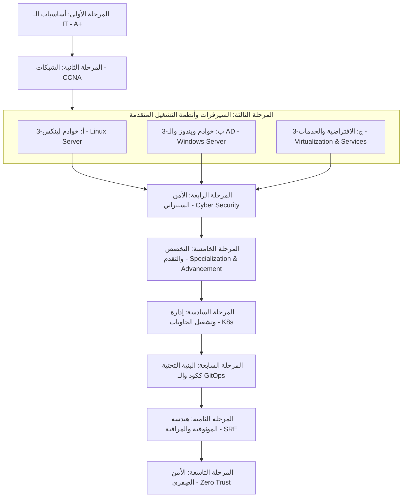

# 🚀 الخطة الشاملة والمسار المهني الاحترافي لمهندس الأنظمة والشبكات (IT Systems & Network Engineer)

مرحباً بك يا صديقي في هذا المسار الاحترافي! الانتقال من الدعم الفني العام (IT Support) إلى التخصص في **السيرفرات والشبكات** هو خطوة ذكية جداً ومطلوبة بقوة في سوق العمل.

هذه خطة عملية، تفصيلية، ومبنية على متطلبات سوق العمل لعام 2026. الخطة تعتمد على المبدأ الذهبي في الـ IT: **"التطبيق العملي والمختبرات المنزلية (Hands-on Practice & Home Labs) تفوق الشهادات النظرية بمراحل."**

---

## 📌 القواعد الذهبية للتعلم والتطور السريع في الـ IT
1. **لا تحفظ الأوامر:** افهم فلسفة عمل البروتوكول أو النظام. جوجل والذكاء الاصطناعي موجودان لتذكيرك بالأوامر، لكنهما لن يفهموا معمارية شبكتك بدلاً منك.
2. **ابنِ مختبرك الخاص (Home Lab) فوراً:** كل مفهوم تدرسه نظرياً، طبقه عملياً في بيئة وهمية.
3. **وثّق ما تتعلمه:** اكتب خطوات إعداد كل سيرفر أو شبكة على مدونة خاصة بك، أو على GitHub. التوثيق هو وسيلتك الأقوى للحصول على وظائف ممتازة.

---

## 🗺️ خريطة الطريق المحدثة المكونة من 9 مراحل (Roadmap Phases)

---

## 📂 تفاصيل المراحل والمصادر والروابط

### 🖥️ المرحلة الأولى: أساسيات تكنولوجيا المعلومات (IT Basics & A+)
بناء أساس قوي في مبادئ تكنولوجيا المعلومات، الأجهزة، والبرمجيات الأساسية.
* **ماذا تتعلم؟** مكونات الكمبيوتر الداخلية والخارجية (CPU، RAM، Storage، Motherboard)، كيفية عمل الكمبيوتر، أنواع أنظمة التشغيل، تجميع الكمبيوتر وصيانته.
* **المصادر:**
  * **Google IT Support Professional Certificate:** [رابط الكورس على Coursera](https://www.coursera.org/professional-certificates/google-it-support)
  * **CompTIA A+ Course:** [كورس A+ على يوتيوب](https://www.youtube.com/playlist?list=PLG49S3nxzAnlGHYsF9IaPf9A8H85GBsJ1)
  * **FreeCodeCamp (Computer Fundamentals):** [شرح أساسيات الكمبيوتر](https://www.youtube.com/watch?v=N6O3qw9QyqU)

---

### 🌐 المرحلة الثانية: الشبكات (Networking)
تعتبر الشبكات العمود الفقري لتكنولوجيا المعلومات. ستتعلم في هذه المرحلة كيفية توصيل الأجهزة وتبادل البيانات.
* **ماذا تتعلم؟** بروتوكول IP (IPv4 & IPv6)، نموذج OSI & TCP/IP، أنواع الشبكات (LAN، WAN)، أجهزة الشبكات (Switch، Router، Access Point)، تكوين الـ IP، إعدادات الـ Switch والـ Router، أساسيات الـ Subnetting، خدمات الشبكة (DHCP، DNS).
* **المصادر:**
  * **CompTIA Network+ (Professor Messer):** [كورس CompTIA Network+ مجاني](https://www.youtube.com/playlist?list=PLG49S3nxzAnlGeBsMYOzqKbUYdLyUN9gp)
  * **NetworkChuck (YouTube):** [قناة NetworkChuck للشبكات](https://www.youtube.com/playlist?list=PLIhvC56v6FUPwP3C7z5HhjF5hC3x-N4G0)
  * **CCNA - Jeremy's IT Lab:** [كورس CCNA مجاني بالكامل](https://www.youtube.com/playlist?list=PLxbivXZeScB9h11oG1Y4eBwHh2n2-d_0E)
  * **Cisco Networking Academy:** [موقع أكاديمية سيسكو](https://www.netacad.com/) لتنزيل Cisco Packet Tracer.
  * **Subnetting Practice:** موقع [SubnettingPractice.com](https://www.subnettingpractice.com/) للتدريب اليومي على حسابات الـ Subnetting.

---

### 🖥️ المرحلة الثالثة: السيرفرات وأنظمة التشغيل المتقدمة (Servers & Advanced OS)
ستنتقل الآن إلى تعلم كيفية إدارة السيرفرات التي تقدم الخدمات للشبكة وإدارة الافتراضية.

#### 🐧 3-أ: إدارة خوادم لينكس (Linux Server)
* **ماذا تتعلم؟** أساسيات سطر الأوامر CLI، التنقل وتعديل الملفات، إدارة المستخدمين والصلاحيات (chmod, chown)، تثبيت الحزم وإدارة الخدمات (systemctl, Package Managers like apt/yum).
* **المصادر:**
  * **CompTIA Linux+ Course:** [بحث كورس Linux+ على يوتيوب](https://www.youtube.com/playlist?list=PLLlr6jKKdyK1FBi3pLVAmilLvMwWHw-84)
  * **Linux Journey:** [موقع مجاني ومبسط جداً لتعلم لينكس بالخطوات](https://linuxjourney.com/).
  * **Learn Linux TV (YouTube):** [كورس تعلم لينكس من الصفر](https://www.youtube.com/playlist?list=PLT98CRl2KxGGPLw0KHb5F4N5ypgcUXsLy).
  * **OverTheWire (Bandit):** [لعبة تفاعلية ممتعة لتعلم أوامر لينكس](https://overthewire.org/wargames/bandit/).
  * **SadServers:** [موقع رائع لحل مشاكل لينكس الحقيقية](https://sadservers.com/).

#### 🪟 3-ب: خوادم ويندوز والـ Active Directory (Windows Server)
* **ماذا تتعلم؟** إدارة Windows Server، إنشاء وإعداد الدليل النشط (Active Directory Domain Services - AD DS)، إدارة المستخدمين والمجموعات والصلاحيات، سياسات المجموعة (Group Policy Objects - GPOs)، وإدارة خدمات DNS و DHCP على ويندوز سيرفر.
* **المصادر:**
  * **Windows Server Administration:** [بحث كورسات Windows Server على يوتيوب](https://www.youtube.com/playlist?list=PLLlr6jKKdyK3pa63FTK2D2_vfjQiyxi5k)
  * **Kevtech IT Support (YouTube):** [تعلم الجانب العملي من Active Directory](https://www.youtube.com/@kevtechitsupport).
  * **Microsoft Learn AD DS:** [المسار الرسمي لتعلم إدارة الهوية والـ Active Directory](https://learn.microsoft.com/en-us/training/paths/manage-identity-access/).

#### ☁️ 3-ج: الافتراضية والخدمات (Virtualization & Services)
* **ماذا تتعلم؟** إعداد خدمات خادم الويب (IIS, Apache, Nginx)، خادم البريد (Mail Server)، خادم قواعد البيانات (Database Server)، إدارة الافتراضية (Hypervisors Type-1 & Type-2 مثل VMware ESXi, Hyper-V, Proxmox VE).
* **المصادر:**
  * **Virtualization (VMware & Hyper-V):** [بحث شروحات VMware و Hyper-V على يوتيوب](https://www.youtube.com/playlist?list=PLLlr6jKKdyK2q80zTIHCtSh_8df1Uy-m7)
  * **Web Servers Setup (IIS, Apache, Nginx):** [بحث إعداد خوادم الويب على يوتيوب](https://www.youtube.com/watch?v=JKxlYmG-b5Y)
  * **Database & Mail Servers:** [بحث إعداد خوادم قواعد البيانات والبريد](https://www.youtube.com/watch?v=HXV3zeQKqGY)

---

### 🛡️ المرحلة الرابعة: الأمن السيبراني (Cyber Security)
حماية الأنظمة والشبكات هي مسؤولية أساسية لكل متخصص IT.

#### 🔒 1. أساسيات الأمن السيبراني (Cyber Security Fundamentals)
* **ماذا تتعلم؟** مبادئ الأمن (Confidentiality, Integrity, Availability - CIA Triad)، أنواع الهجمات (Phishing, Malware, DoS/DDoS)، تقييم المخاطر وثغرات الأنظمة، وسياسات الأمن الإلكتروني وقوانين الأمان.
* **المصادر:**
  * **Google Cybersecurity Professional Certificate:** [رابط الشهادة الاحترافية على Coursera](https://www.coursera.org/professional-certificates/google-cybersecurity)
  * **CompTIA Security+ (Free4Arab):** [سلسلة شرح عربي كامل لـ Security+](https://www.youtube.com/playlist?list=PLLlr6jKKdyK0G8jXNlL-tHR-7FO4vgXkb)
  * **Professor Messer Security+:** [كورس Security+ الشهير على يوتيوب](https://www.youtube.com/user/professormesser)
  * **The Cyber Mentor (YouTube):** [قناة The Cyber Mentor لتعلم الأمن السيبراني والاختراق الأخلاقي](https://www.youtube.com/@TCMSecurityAcademy)

#### 🛡️ 2. أمن الشبكات والأنظمة (Network & System Security)
* **ماذا تتعلم؟** جدران الحماية (Firewalls مثل PfSense)، أنظمة كشف ومنع التسلل (IDS/IPS)، أمن الشبكات اللاسلكية (Wireless Security)، التشفير ومفاتيح الحماية (Cryptography & SSL/TLS)، وإدارة الهوية والوصول (Identity & Access Management - IAM).
* **المصادر:**
  * **Harvard Network Security Course:** [كورس هارفارد لأمن الأنظمة والشبكات على يوتيوب](https://www.youtube.com/watch?v=N6O3qw9QyqU)
  * **PortSwigger Web Security Academy:** [أكاديمية بورت سويجر لتعلم أمن الويب](https://portswigger.net/web-security)

---

### 🚀 المرحلة الخامسة: التخصص والتقدم (Specialization & Advancement)
في هذه المرحلة، يمكنك اختيار التخصص في مجال معين وتطوير مهاراتك بشكل أعمق في الحوسبة السحابية، البرمجة والأتمتة، والمسارات المهنية.
* **الحوسبة السحابية (Cloud Computing):**
  * **ماذا تتعلم؟** مفاهيم السحابة الأساسية (IaaS, PaaS, SaaS)، والخدمات السحابية الرئيسية لمزودي الخدمات مثل AWS و Azure و Google Cloud.
  * **المصادر:** كورسات شهادات AWS Certified Cloud Practitioner، أو Azure Fundamentals، أو GCP Digital Leader، وقنوات يوتيوب الرسمية لـ AWS و Azure.
* **البرمجة والأتمتة (Scripting & Automation):**
  * **ماذا تتعلم؟** أساسيات البرمجة باستخدام لغتي Python و PowerShell، وكيفية كتابة سكربتات لتسهيل وأتمتة المهام المتكررة في إدارة الأنظمة والشبكات.
  * **المصادر:** كورس Python for Beginners (FreeCodeCamp / Codecademy)، وكورسات PowerShell للمبتدئين على Udemy أو يوتيوب.
* **التخصصات الأخرى:**
  * **ماذا تتعلم؟** استكشاف مسارات التخصص المتقدمة الأخرى لاختيار التخصص النهائي، مثل الـ DevOps، أو إدارة المشاريع (Project Management)، أو تحليل البيانات (Data Analysis) في قطاع تكنولوجيا المعلومات.

---

### 📦 المرحلة السادسة: إدارة وتشغيل الحاويات المتقدمة (Kubernetes)
إدارة وتوزيع الحاويات وضمان توافرها العالي في البيئات الإنتاجية الضخمة.
* **ماذا تتعلم؟** معمارية Kubernetes Cluster، الكائنات الأساسية (Pods, Deployments, Services, Ingress)، وإدارة الحزم Helm Charts.
* **المصادر:**
  * **TechWorld with Nana (K8s Course):** [كورس Kubernetes كامل للمبتدئين](https://www.youtube.com/watch?v=X48VuDVv0do)
  * **KodeKloud CKA Course:** دورة التحضير لشهادة CKA مع مختبرات عملية تفاعلية.

---

### 🔄 المرحلة السابعة: البنية التحتية ككود والـ GitOps (GitOps & IaC)
تحويل كتابة إعدادات السيرفرات وشبكات السحابة من واجهات رسومية إلى أكواد برمجية يتم حفظها وإدارتها في Git.
* **ماذا تتعلم؟** لغة Terraform لبناء الموارد السحابية، إدارة الحالات (Terraform State)، فلسفة الـ GitOps ومزامنة إعدادات Kubernetes باستخدام ArgoCD.
* **المصادر:**
  * **FreeCodeCamp Terraform Course:** كورس شامل لتعلم الـ Terraform للمبتدئين عملياً على يوتيوب.
  * **ArgoCD Docs:** [موقع ArgoCD الرسمي](https://argo-cd.readthedocs.io/).

---

### 📊 المرحلة الثامنة: هندسة الموثوقية والمراقبة (SRE & Observability Stack)
الحفاظ على استقرار السيرفرات والشبكات وسرعتها ومتابعة حالتها الصحية على مدار الساعة.
* **ماذا تتعلم؟** حساب نسبة التوافر ومؤشرات الأداء (SLIs, SLOs, Error Budgets)، جمع مقاييس السيرفرات باستخدام Prometheus، بناء لوحات تحكم بصري باستخدام Grafana، وتجميع السجلات عبر Loki.
* **المصادر:**
  * **Grafana Crash Course (YouTube):** شروحات مبسطة لربط خوادمك وعرض أدائها بصرياً.
  * **SRE Book by Google:** الكتاب الأسطوري المجاني من جوجل لتعلم فلسفة هندسة موثوقية الأنظمة.

---

### 🛡️ المرحلة التاسعة: الشبكات المتقدمة والأمن الصِفري (Zero Trust Security)
تطبيق معمارية الأمن الصِفري وبناء شبكات اتصالات مشفرة بالكامل عن بعد لحماية البيانات.
* **ماذا تتعلم؟** معمارية الأمن الصِفري (Zero Trust - ZTNA)، بناء شبكات VPN مشفرة وفائقة السرعة بـ WireGuard/Tailscale، إدارة شهادات SSL/TLS وتجديدها بـ Let's Encrypt، وجدران حماية الويب WAF.
* **المصادر:**
  * **Hussein Nasser (YouTube):** [قناة ممتازة لتعلم خبايا شبكات الويب والـ Backend](https://www.youtube.com/@hnasr).
  * **Tailscale Docs:** شروحات مذهلة لكيفية بناء شبكة VPN آمنة ومشفرة بالكامل لجميع أجهزتك.

---

## 🏗️ كيف تبني مختبرك المنزلي بأقل التكاليف (Your Free/Low-Cost Home Lab)
التدريب العملي الحقيقي يحتاج بيئة متكاملة. إليك طريقتين لعمل ذلك:

### 💻 الخيار الأول: المختبر الافتراضي بالكامل (على لابتوبك الحالي)
* **المتطلبات:** لابتوب بمعالج Core i5/i7 على الأقل، ورامات لا تقل عن 16 جيجابايت (يفضل 32 جيجابايت لتشغيل عدة سيرفرات معاً)، وهارد ديسك SSD سريع.
* **الخطوات:**
  1. قم بتثبيت برنامج **VirtualBox** أو تفعيل **Hyper-V** على جهازك.
  2. قم بتحميل نظام **Ubuntu Server ISO** ونظام **Windows Server Evaluation ISO** (نسخة مجانية للتجربة لمدة 180 يوماً من مايكروسوفت).
  3. ابنِ شبكة داخلية (Internal Network) داخل برنامج الـ VMs، واجعل الويندوز سيرفر يوزع عناوين IP (DHCP) لباقي الأجهزة الافتراضية.

### 🖥️ الخيار الثاني: السيرفر المنزلي المستقل (Home Lab Server) - *موصى به جداً مستقبلاً*
* **المتطلبات:** كمبيوتر مكتبي قديم أو مستعمل (مثل أجهزة الـ OptiPlex المستعملة رخيصة الثمن) مع زيادة الرامات وهارد SSD.
* **الخطوات:**
  1. قم بتثبيت نظام **Proxmox VE** كنظام تشغيل أساسي للجهاز (Bare-Metal Hypervisor).
  2. قم بإدارة الجهاز عن بعد بالكامل من متصفح لابتوبك الأساسي.
  3. يمكنك الآن تشغيل 10-15 سيرفر افتراضي صغير (VMs / LXC Containers) على هذا الجهاز دون التأثير على أداء لابتوبك الشخصي.
